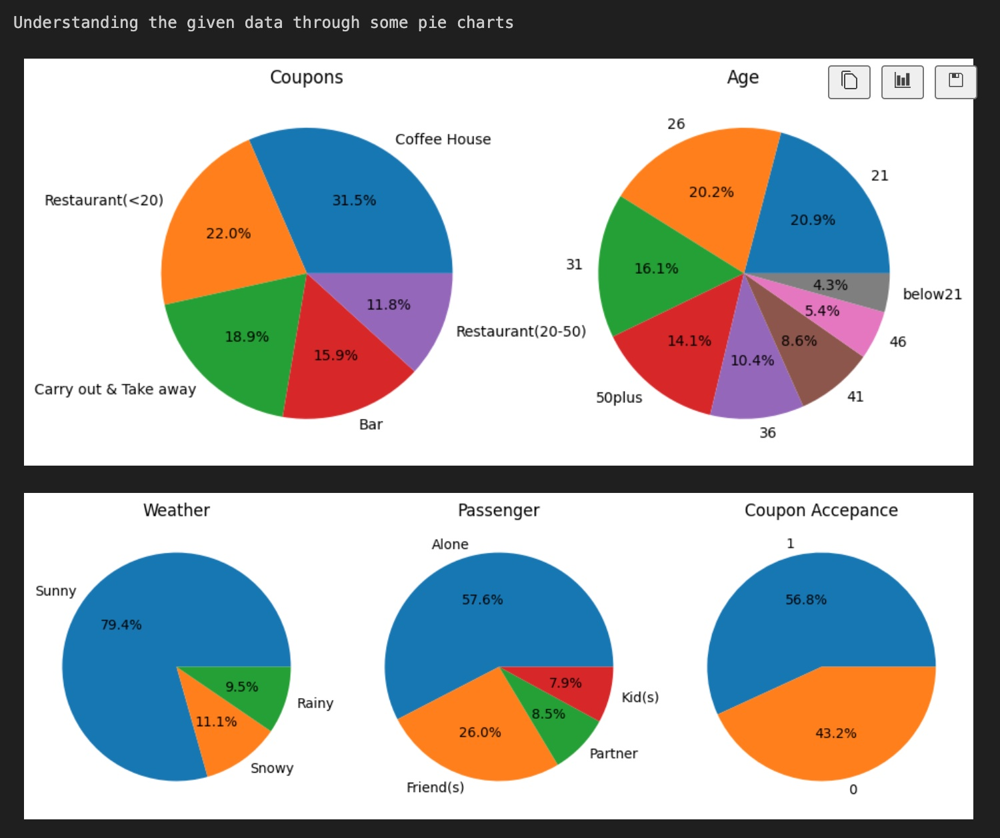

# Driving Coupon Acceptance Analysis

## Getting Started

## Introduction

This project analyzes the factors that influence whether drivers accept digital coupons delivered to their mobile devices while driving. The goal is to use visualizations and statistical analysis to distinguish between customers who accepted driving coupons versus those who declined them.

Respondents were presented with different driving scenarios—including destination, time, weather, passenger type, and coupon details—and asked whether they would accept the coupon if they were the driver.

The dataset includes five coupon categories:

- Coffee houses
- Restaurants (under $20)
- Carry out & take away
- Bars
- Restaurants ($20-$50)

## Understanding the Data

The dataset contains multiple attributes that can be studied upon:

- Demographics: gender, age, marital status, number of children
- Education and occupation
- Annual income
- Frequency of visits to bars, coffee houses, takeaway restaurants, and dine-in restaurants
- Driving destination (home, work, no urgent destination)
- Weather conditions (sunny, rainy, snowy)
- Temperature (30°F, 55°F, 80°F)
- Time of day (10AM, 2PM, 6PM)
- Passenger type (alone, partner, kids, friends)
- Expiration time (2 hours or 1 day)

### Data Distribution

The pie charts below visualize the distribution of coupon types and weather conditions in the dataset:

## Data Cleanup

The raw dataset contained several data quality issues as evidenced by the above pie charts. These were addressed to enable accurate analysis as below:

**Handling Missing Values:**

- Several columns contained null values including `car`, `Bar`, `CoffeeHouse`, `CarryAway`, `RestaurantLessThan20`, and `Restaurant20To50`
- Rather than dropping rows (which would reduce our dataset significantly), missing values were replaced with sensible defaults:
  - `car`: replaced nulls with "do not drive" (at first was thought of as a very important column but apparently not!)
  - Venue visit frequency columns: replaced with "never" (indicating the person doesn't visit that venue type)
- This approach preserved data integrity while maintaining a large sample size for analysis—**almost no rows were dropped**

**Data Type Corrections:**

- **Age:** Converted from categorical strings (e.g., "below21", "21-25", "50plus") to numeric values for quantitative analysis
- **Income:** Converted from income range strings (e.g., "$25000 - $37499") to numeric values representing the upper bound of each range for easier comparison and filtering
- These conversions enabled more sophisticated statistical analyses and filtering operations

The cleaned dataset is now ready for exploratory data analysis and visualization to identify patterns in coupon acceptance behavior.

## Key Findings & Conclusions

Analysis of the coupon acceptance data reveals several important patterns:

### Overall Acceptance Rates

**Across all coupon types:**

- Overall coupon acceptance rate: **41%** (41% of all delivered coupons were accepted)
- This baseline provides context for understanding which customer segments are more or less likely to engage with offers

### Acceptance by Coupon Type

Acceptance rate of coupon categories is:

- **Coffee House coupons**: ~50%
- **Carry Out & Take Away coupons**: ~49%
- **Restaurant coupons (under $20)**: ~41%
- **Bar coupons**: ~27%
- **Expensive Restaurant coupons ($20-$50)**: ~24%

### Bar Coupon Insights (Deep Dive)

Among bar coupon recipients specifically, differences emerge based on customer behavior:

**Frequency of bar visits:** Repeat customers are more likely to accept bar coupons

**Age matters:** Younger, frequent bar-goers are the highest-value target segment

**Passengers matter:** Drivers with **adult passengers** (partner or friends) are more likely to accept bar coupons

### Conclusion

1. **Target frequent customers**: Focus marketing efforts on established customers. The data shows repeat customers have 2-3x higher acceptance rates than infrequent visitors.

2. **Coffee and casual dining are strong performers**: These coupon categories naturally drive higher engagement—consider investing more resources here.

3. **Bar coupons need better positioning**: Consider delivering bar coupons specifically to frequent bar-goers rather than the general population.

4. **Consider passenger type and time of delivery**: Adult passengers increase acceptance, while families with children do not. Coupons delivered during times when drivers are likely traveling alone or with adults may perform better.

5. **Age segmentation**: Young adults (under 30) are particularly responsive to offers for social venues like bars.
